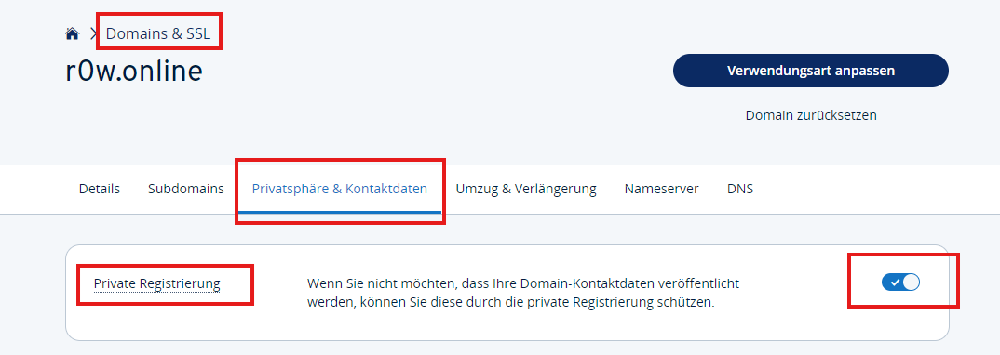
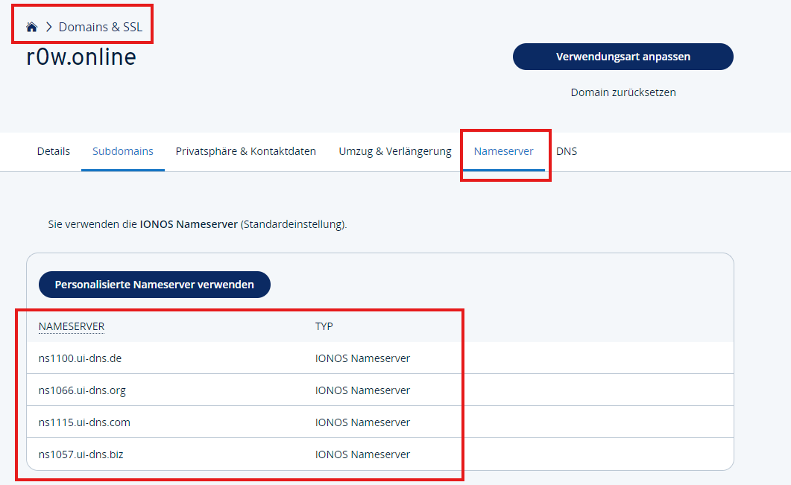
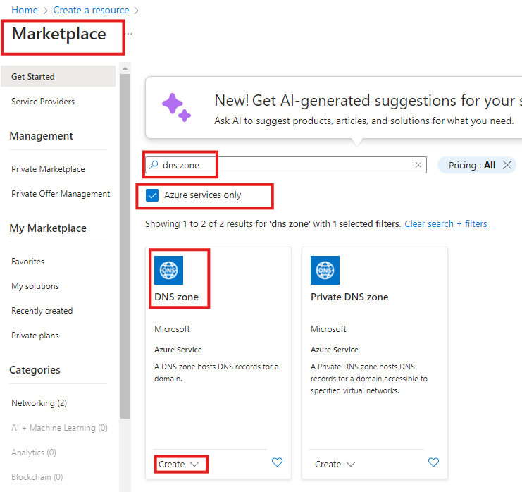
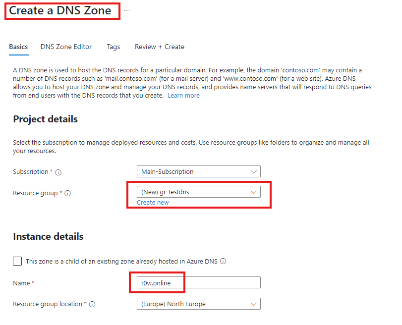
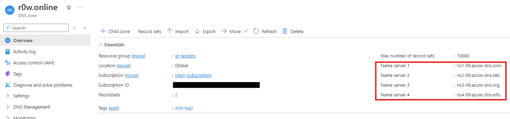
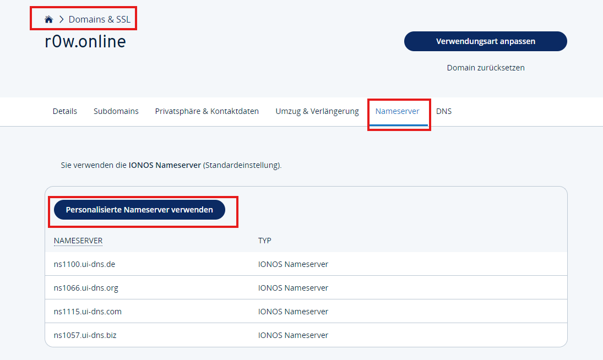
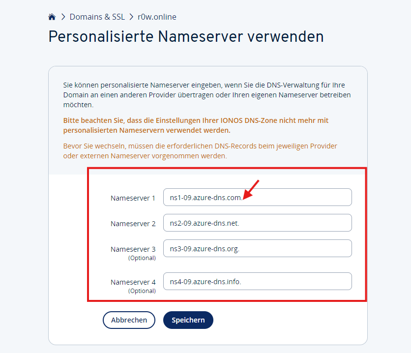
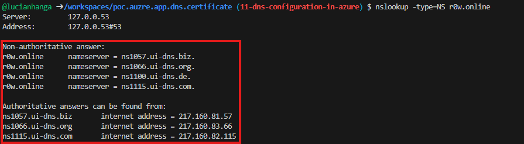
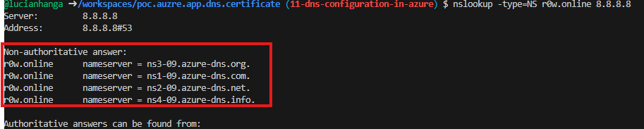

# Configuring Azure DNS


## Get an Name from a Domain Registrar 

For the purpose of this documentation, I used [ionos.com](https://www.ionos.com) to register a domain name. 
If you don't want your personal information to be public, you can use the domain privacy feature. 



⚠️ **Warning:**  If you enable domain privacy, the contract will automatically renew after the first year. You can disable the domain privacy feature after the first year.

## Locate the DNS Settings

After you have registered a domain name, you will need to locate the DNS settings. This is where you will add the Azure DNS servers.




## Azure Console

Login to the Azure console with your developer account. And click on the `Create a resource` button. Search for `DNS Zone` and click on the `Create` button.



### Create a DNS Zone

Create a new resoruce group or use an existing one. Enter the domain name you registered and click on the `Review + Create` button.
Then click on the `Create` button.



Wait a few minutes for the DNS zone to be created.
Once the DNS zone is created, click on the `Go to resource` button.
Here you will see the DNS servers that you will need to add to your domain registrar.



### Add DNS Servers to Domain Registrar

Go back to your domain registrar and add the DNS servers to the DNS settings.





⚠️ **Important:**  Don't forget to remove the **dots** at the end of the DNS servers, because otherwise you will get an error message.

⚠️ **Important:** Once this completed, you will need to wait a few minutes for the DNS servers to propagate. You can check the status of the DNS servers by using the `nslookup` command.

### Verify DNS Servers

Open a terminal and type the following command to see if the DNS servers have been propagated. Replace `your-domain-name.com` with your domain name.

```bash
nslookup -type=NS your-domain-name.com 8.8.8.8
```

if you don't have it installed, you can install it with the following command:

```bash
sudo apt-get install dnsutils
```

Before the DNS servers have propagated, you should see something like this (or a similar output, depending on your domain registrar):



After the DNS servers have propagated, you should see something like this:



## Azure CLI

You can also use the Azure CLI to create a DNS zone. First login with you developer account:

```bash 
az login
```
Create a resource group with the following command:

```bash
az group create --name gr-testdns2 --location westeurope
```

Then create a new DNS zone with the following command:

```bash
az network dns zone create -g gr-testdns2 -n r0w.online
```

you an output similar with:

```json
{
  "etag": "xxxxxxxx-xxxx-xxxx-xxxx-xxxxxxxxxxxx",
  "id": "/subscriptions/xxxxxxxx-xxxx-xxxx-xxxx-xxxxxxxxxxxx/resourceGroups/gr-testdns2/providers/Microsoft.Network/dnszones/example.com",
  "location": "global",
  "maxNumberOfRecordSets": 10000,
  "name": "example.com",
  "nameServers": [
    "ns1-04.azure-dns.com.",
    "ns2-04.azure-dns.net.",
    "ns3-04.azure-dns.org.",
    "ns4-04.azure-dns.info."
  ],
  "numberOfRecordSets": 2,
  "resourceGroup": "gr-testdns2",
  "tags": {},
  "type": "Microsoft.Network/dnszones",
  "zoneType": "Public"
}
```

You can also use the Azure CLI to get the DNS servers:

```bash
az network dns zone show -g gr-testdns2 -n r0w.online --query nameServers
```

You should see an output similar with:

```json
[
  "ns1-04.azure-dns.com.",
  "ns2-04.azure-dns.net.",
  "ns3-04.azure-dns.org.",
  "ns4-04.azure-dns.info."
]
```
## Terraform

For the terraform code, check out the `./terraform` directory, where is the IaC code for this project.
