# Configuring Azure DNS, HTTPS Certificates

Table of Contents

- [Configuring Azure DNS, HTTPS Certificates](#configuring-azure-dns-https-certificates)
  - [Configuring Azure DNS](#configuring-azure-dns)
    - [Get an Name from a Domain Registrar](#get-an-name-from-a-domain-registrar)
    - [Locate the DNS Settings](#locate-the-dns-settings)
    - [Azure Console](#azure-console)
      - [Create a DNS Zone](#create-a-dns-zone)
      - [Add DNS Servers to Domain Registrar](#add-dns-servers-to-domain-registrar)
      - [Verify DNS Servers](#verify-dns-servers)
    - [Azure CLI](#azure-cli)
    - [Terraform](#terraform)
  - [HTTPS Certificates](#https-certificates)
    - [Let's Encrypt Certificates - Manual Installation](#lets-encrypt-certificates---manual-installation)
      - [Install and configure certbot](#install-and-configure-certbot)
      - [Create a configuration file](#create-a-configuration-file)
      - [Create the certificate and the wildcard certificate](#create-the-certificate-and-the-wildcard-certificate)
    - [Use The Let's Encrypt Certificates with Azure App Service](#use-the-lets-encrypt-certificates-with-azure-app-service)
      - [Prepare the certificate files](#prepare-the-certificate-files)
      - [Create an Azure Key Vault](#create-an-azure-key-vault)
    - [Azure Portal](#azure-portal)

## Configuring Azure DNS

### Get an Name from a Domain Registrar 

For the purpose of this documentation, I used [ionos.com](https://www.ionos.com) to register a domain name. 
If you don't want your personal information to be public, you can use the domain privacy feature. 


⚠️ **Warning:**  If you enable domain privacy, the contract will automatically renew after the first year. You can disable the domain privacy feature after the first year.

### Locate the DNS Settings

After you have registered a domain name, you will need to locate the DNS settings. This is where you will add the Azure DNS servers.


### Azure Console

Login to the Azure console with your developer account. And click on the `Create a resource` button. Search for `DNS Zone` and click on the `Create` button.


#### Create a DNS Zone

Create a new resoruce group or use an existing one. Enter the domain name you registered and click on the `Review + Create` button.
Then click on the `Create` button.


Wait a few minutes for the DNS zone to be created.
Once the DNS zone is created, click on the `Go to resource` button.
Here you will see the DNS servers that you will need to add to your domain registrar.


#### Add DNS Servers to Domain Registrar

Go back to your domain registrar and add the DNS servers to the DNS settings.


⚠️ **Important:**  Don't forget to remove the **dots** at the end of the DNS servers, because otherwise you will get an error message.

⚠️ **Important:** Once this completed, you will need to wait a few minutes for the DNS servers to propagate. You can check the status of the DNS servers by using the `nslookup` command.

#### Verify DNS Servers

Open a terminal and type the following command to see if the DNS servers have been propagated. Replace `your-domain-name.com` with your domain name.

```bash
nslookup -type=NS your-domain-name.com 8.8.8.8
```

if you don't have it installed, you can install it with the following command:

```bash
sudo apt-get install dnsutils
```

Before the DNS servers have propagated, you should see something like this (or a similar output, depending on your domain registrar):


After the DNS servers have propagated, you should see something like this:


### Azure CLI

You can also use the Azure CLI to create a DNS zone. First login with you developer account:

```bash 
az login
```
Create a resource group with the following command:

```bash
az group create --name gr-testdns2 --location westeurope
```

Then create a new DNS zone with the following command:

```bash
az network dns zone create -g gr-testdns2 -n r0w.online
```

you an output similar with:

```json
{
  "etag": "xxxxxxxx-xxxx-xxxx-xxxx-xxxxxxxxxxxx",
  "id": "/subscriptions/xxxxxxxx-xxxx-xxxx-xxxx-xxxxxxxxxxxx/resourceGroups/gr-testdns2/providers/Microsoft.Network/dnszones/example.com",
  "location": "global",
  "maxNumberOfRecordSets": 10000,
  "name": "example.com",
  "nameServers": [
    "ns1-04.azure-dns.com.",
    "ns2-04.azure-dns.net.",
    "ns3-04.azure-dns.org.",
    "ns4-04.azure-dns.info."
  ],
  "numberOfRecordSets": 2,
  "resourceGroup": "gr-testdns2",
  "tags": {},
  "type": "Microsoft.Network/dnszones",
  "zoneType": "Public"
}
```

You can also use the Azure CLI to get the DNS servers:

```bash
az network dns zone show -g gr-testdns2 -n r0w.online --query nameServers
```

You should see an output similar with:

```json
[
  "ns1-04.azure-dns.com.",
  "ns2-04.azure-dns.net.",
  "ns3-04.azure-dns.org.",
  "ns4-04.azure-dns.info."
]
```
### Terraform

For the terraform code, check out the `./terraform` directory, where is the IaC code for this project.

## HTTPS Certificates

### Let's Encrypt Certificates - Manual Installation

To generate a free HTTPS certificate, you can use [Let's Encrypt](https://letsencrypt.org/). For the certifiate to be generated, you will need to have a domain name and the DNS servers configured.
Also you need the tool `certbot` to generate the certificate.

#### Install and configure certbot

create an python virtual environment and activate it:

```bash
python3 -m venv venv
source venv/bin/activate
```

install the `certbot` and `certbot-dns-azure` plugin:

```bash
pip3 install certbot
pip3 install certbot-dns-azure
```

Check the version of certbot and the plugins:

```bash
certbot --version
certbot plugins
```
output should be similar with:

```bash
* dns-azure
Description: Obtain certificates using a DNS TXT record (if you are using Azure
for DNS).
Interfaces: Authenticator, Plugin
Entry point: EntryPoint(name='dns-azure',
value='certbot_dns_azure._internal.dns_azure:Authenticator',
group='certbot.plugins')
```

#### Create a configuration file

Create a configuration file `certbot.ini` with the following content:

```ini
dns_azure_sp_client_id = "xxxxxxxx-xxxx-xxxx-xxxx-xxxxxxxxxxxx"
dns_azure_sp_client_secret = "xxxxxxxx-xxxx-xxxx-xxxx-xxxxxxxxxxxx"
dns_azure_subscription_id = "xxxxxxxx-xxxx-xxxx-xxxx-xxxxxxxxxxxx"
dns_azure_tenant_id = "xxxxxxxx-xxxx-xxxx-xxxx-xxxxxxxxxxxx"

dns_azure_environment = "AzurePublicCloud"

dns_azure_zone1 = "your-dns-zone:/subscriptions/xxxxxxxx-xxxx-xxxx-xxxx-xxxxxxxxxxxx/resourceGroups/your-resource-group"
```
⚠️ **Attention:** Make sure that you use your own values for the: 
- `dns_azure_sp_client_id`, 
- `dns_azure_sp_client_secret`, 
- `dns_azure_subscription_id`, 
- `dns_azure_tenant_id` and 
- `dns_azure_zone1` fields

The Service Principal (SP) was already created by the bootstrap script. You can find the values in the `./terraform/terraform.tfstate` file.
The `dns_azure_zone1` field should be in the format `your-dns-zone:/subscriptions/xxxxxxxx-xxxx-xxxx-xxxx-xxxxxxxxxxxx/resourceGroups/your-resource-group` and is the one you created in the chapter above.

#### Create the certificate and the wildcard certificate

Since its a root domain, you will need to create a **wildcard** certificate which later can be used for subdomains.

Run it with the following command.

```bash
sudo certbot certonly \
  --authenticator dns-azure \
  --preferred-challenges dns-01
  --dns-azure-config certbot.ini \
  --non-interactive \
  --agree-tos \
  -d '*.r0w.online' \
  -d r0w.online
```

⚠️ **Attention:** Make sure that that you replace the `*.r0w.online` and `r0w.online` with your domain name.


show the certificates

```bash
sudo certbot certificates
```

list the certificate files

```bash
sudo ls /etc/letsencrypt/live/r0w.online/
```
 
output should be similar with:

```bash
README  cert.pem  chain.pem  fullchain.pem  privkey.pem
```

use openssl to check the full chain

```bash
sudo openssl x509 \
  -in /etc/letsencrypt/live/r0w.online/fullchain.pem \
  -text
```
use openssl to check the certificate

```bash
sudo openssl x509 \
  -in /etc/letsencrypt/live/r0w.online/cert.pem \
  -text
```

### Use The Let's Encrypt Certificates with Azure App Service

#### Prepare the certificate files

You will need to prepare the certificate files for the Azure App Service. You can use the `openssl` command to create a `.pfx` file.

```bash
sudo openssl pkcs12 -export \
  -out r0w.online.pfx \
  -inkey /etc/letsencrypt/live/r0w.online/privkey.pem \
  -in /etc/letsencrypt/live/r0w.online/cert.pem \
  -certfile /etc/letsencrypt/live/r0w.online/chain.pem
  -passout pass:myPassword
sudo chown $USER:$USER r0w.online.pfx
```

Make a pem file containing all the certificates in the chain and the private key to be used in the Azure Key Vault or directly in the Azure App Service.
Make sure that you add a password to the file, as dummy as it gets, but you **need** it for import in the App Service. The App Service will **not accept** the file without a password.

⚠️ **Attention:**  If you don't plan to purge the certificate files imediately you should really consider to encrypt the file with a strong password.


```bash
sudo cat \
  /etc/letsencrypt/live/r0w.online/fullchain.pem \
  /etc/letsencrypt/live/r0w.online/privkey.pem \
  > r0w.online.pem
sudo chown $USER:$USER r0w.online.pem
```


#### Create an Azure Key Vault

### Azure Portal

Login to the Azure portal with your developer account. Click on the `Create a resource` button and search for `Key Vault`. Click on the `Create` button.

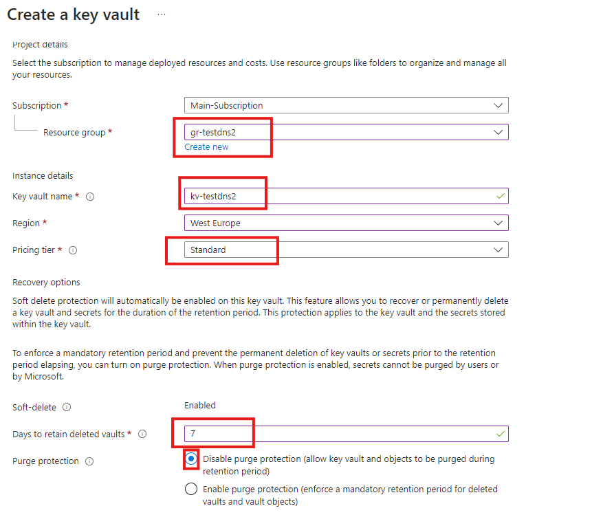

after creation click on the `Go to resource` button and click on the `Certificates` link.

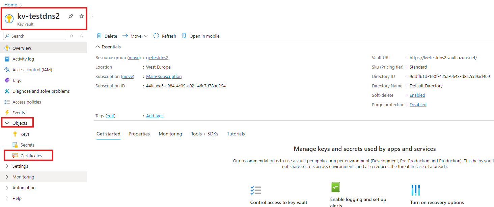


You might see this error message: 

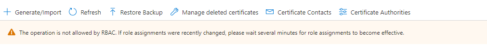

To fix this error give yourself the `Key Vault Certificates Officer` role. If you can't, ask your administrator to do it for you.

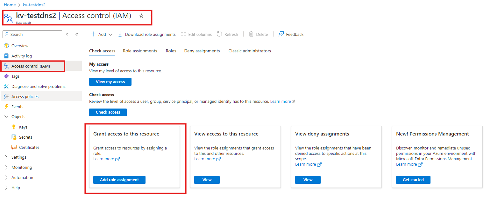

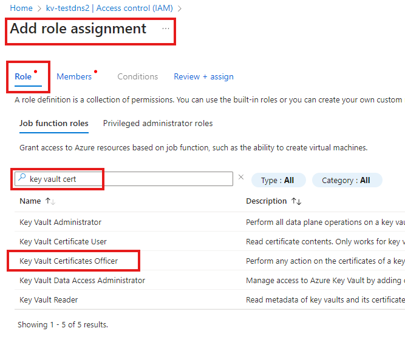

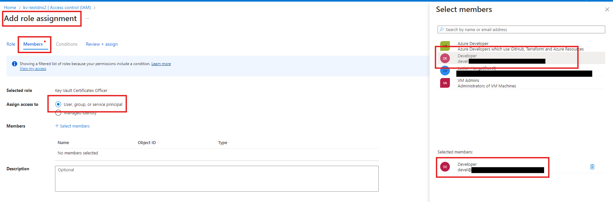

Create the certificate by clicking on the `Generate/Import` button.

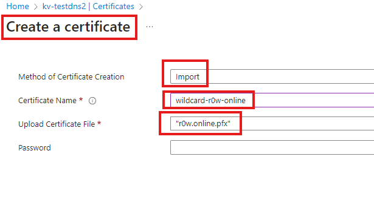

Enable the Web App System Assigned Identity.

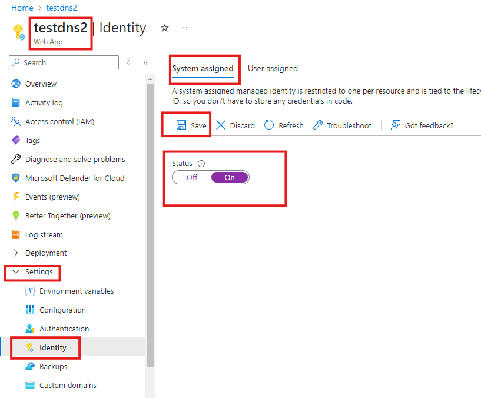

Give the Web App rights to the certificate.

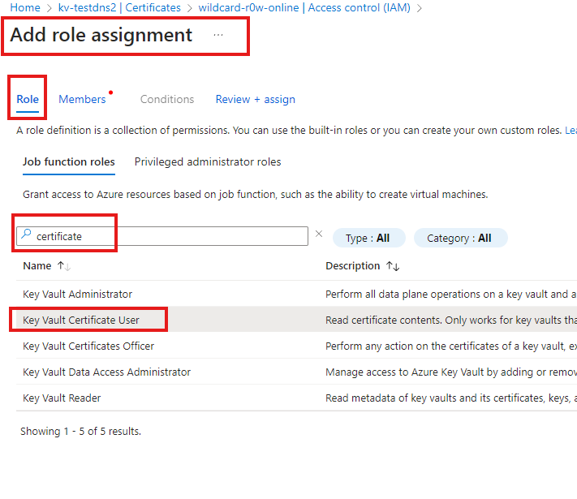

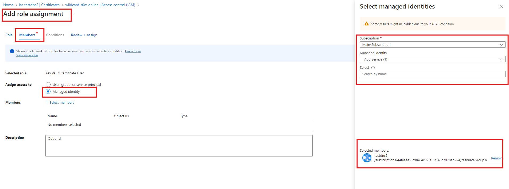

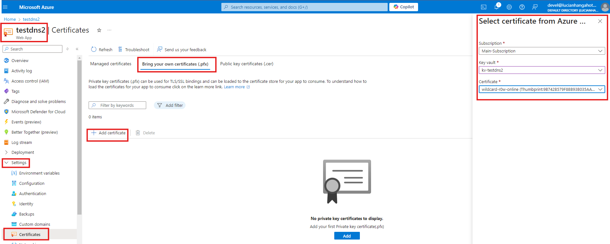

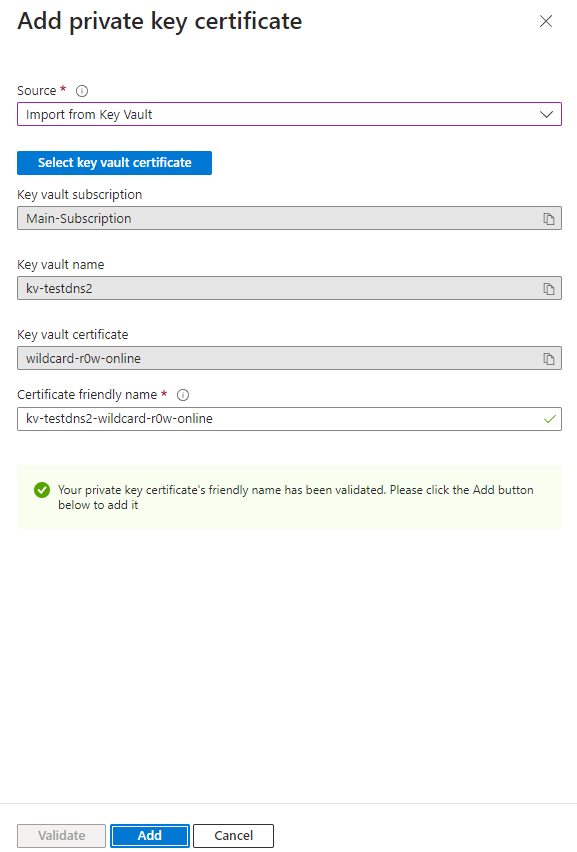

